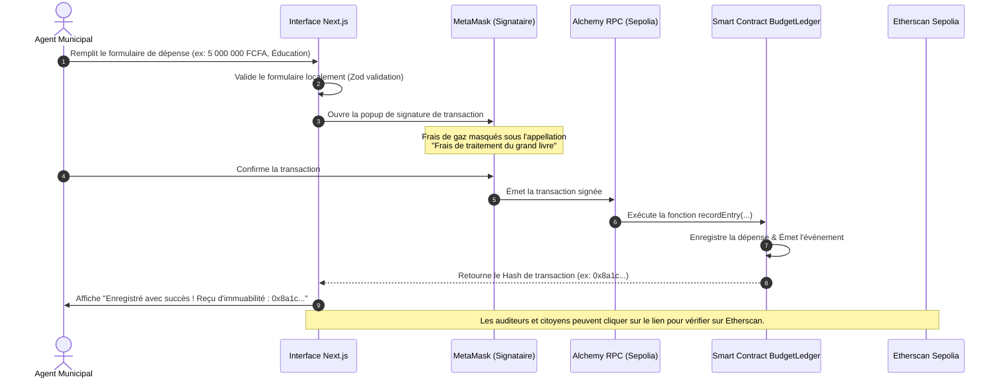
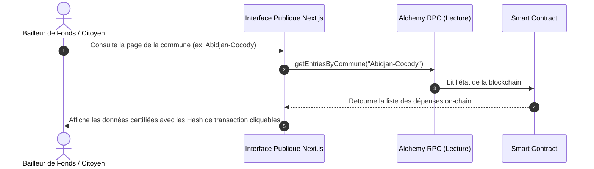

# 🗺️ ReadmeRoadmap.md — MVP KOMOE (Blockchain Sepolia)

> **Projet :** KOMOE — Transparence Budgétaire sur Blockchain  
> **Auteur :** Expert Dev Web3 (10 ans d'expérience)  
> **Cible :** Transition d'une application statique à un MVP fonctionnel on-chain en **6 heures**  
> **Réseau :** Ethereum Sepolia Testnet (Chain ID : `11155111`)

---

## 📌 1. Vision & Objectifs du MVP

L'objectif de **KOMOE** est de rendre l'utilisation des budgets communaux en Côte d'Ivoire totalement transparente et immuable. Chaque dépense, recette ou allocation de budget doit être inscrite de manière indélébile dans la blockchain Ethereum (via le réseau de test Sepolia).

Ce document décrit la feuille de route précise pour **convertir l'application statique Next.js existante** en une application décentralisée (dApp) fonctionnelle.

### 🛡️ UX Simplifiée ("Masquée") pour les utilisateurs locaux
En Afrique, la complexité de la blockchain (gestion des clés privées, frais de gaz, hachages hexadécimaux) peut constituer un frein majeur à l'adoption. 
- **Approche No-Crypto UX** : Les termes techniques sont masqués au maximum dans l'interface utilisateur.
- **Terminologie adaptée** :
  - *Gas Fee* → Frais de traitement.
  - *Transaction Hash* → Identifiant unique d'immuabilité (Reçu numérique).
  - *Smart Contract* → Grand livre public cryptographique.
- **MetaMask voilé** : L'agent municipal ou l'auditeur interagit simplement avec un bouton "Valider & Enregistrer", et MetaMask sert de module de signature d'arrière-plan avec un compte pré-configuré (ou via un wallet partagé de la commune).

---

## 🛠️ 2. Stack & Outils Blockchain à Utiliser

Pour finaliser ce MVP en moins de 6 heures, voici la sélection rigoureuse d'outils et de bibliothèques compatibles avec votre stack (`Next.js 16`, `React 19`, `ethers.js v6`).

| Outil | Rôle dans KOMOE | Accès / Installation |
|---|---|---|
| **MetaMask** | Portefeuille d'identité et de signature de l'agent communal (Maire/Trésorier). | Extension Navigateur |
| **Sepolia Testnet** | Réseau Ethereum de test gratuit avec le même niveau de sécurité que le Mainnet. | Intégré par défaut dans MetaMask |
| **Infura / Alchemy** | Nœud RPC de lecture/écriture pour connecter l'application Next.js à la blockchain Sepolia. | [Alchemy](https://dashboard.alchemy.com/) (Clé d'API gratuite) |
| **ethers.js (v6)** | Librairie de communication entre Next.js et MetaMask / le RPC. | `npm install ethers` |
| **Hardhat** | Framework local de compilation, de test et de déploiement du Smart Contract. | `npm install --save-dev hardhat` |
| **Etherscan Sepolia API** | Explorateur pour vérifier les transactions en temps réel et publier le code du contrat. | [Sepolia Etherscan](https://sepolia.etherscan.io/) |

---

## 🔄 3. Les Flux de Transactions (Workflows)

Afin d'assurer la transparence budgétaire totale comme décrit dans les documents du dossier `ContextDocs`, voici les flux de données prévus pour le MVP.

### A. Flux de Saisie et de Signature d'une Dépense Communale
Ce flux permet à l'agent municipal d'enregistrer une ligne budgétaire de manière immuable.



### B. Flux d'Audit et de Consultation Citoyenne / Bailleurs
Ce flux est 100% transparent et ne nécessite aucune connexion ou installation de portefeuille crypto.



---

## 📄 4. Le Smart Contract : `BudgetLedger.sol`

Voici le contrat Solidity minimaliste à déployer sur Sepolia pour faire fonctionner le MVP. Il gère l'immuabilité et l'authentification des agents.

```solidity
// SPDX-License-Identifier: MIT
pragma solidity ^0.8.20;

contract BudgetLedger {
    address public owner;
    
    struct BudgetEntry {
        uint256 id;
        uint256 montant;       // En Francs CFA (XOF)
        string categorie;      // Exemple: INFRA, SANTE, EDU
        string beneficiaire;   // Nom de l'entreprise ou prestataire
        string description;
        string commune;        // Nom ou code de la commune
        address signataire;    // Adresse de l'agent qui a validé
        uint256 timestamp;     // Timestamp Unix
    }

    BudgetEntry[] private entries;
    mapping(uint256 => bool) public entryExists;

    event BudgetEntryRecorded(
        uint256 indexed id,
        uint256 montant,
        string commune,
        string categorie,
        uint256 timestamp
    );

    modifier onlyOwner() {
        require(msg.sender == owner, "Seul le gestionnaire de la commune peut signer");
        _;
    }

    constructor() {
        owner = msg.sender;
    }

    function recordEntry(
        uint256 _id,
        uint256 _montant,
        string memory _categorie,
        string memory _beneficiaire,
        string memory _description,
        string memory _commune
    ) external onlyOwner {
        require(!entryExists[_id], "Identifiant de transaction deja existant");

        BudgetEntry memory newEntry = BudgetEntry({
            id: _id,
            montant: _montant,
            categorie: _categorie,
            beneficiaire: _beneficiaire,
            description: _description,
            commune: _commune,
            signataire: msg.sender,
            timestamp: block.timestamp
        });

        entries.push(newEntry);
        entryExists[_id] = true;

        emit BudgetEntryRecorded(_id, _montant, _commune, _categorie, block.timestamp);
    }

    function getEntriesCount() external view returns (uint256) {
        return entries.length;
    }

    function getEntry(uint256 index) external view returns (BudgetEntry memory) {
        require(index < entries.length, "Index hors limites");
        return entries[index];
    }
}
```

---

## 🚀 5. Roadmap  pour Finaliser le MVP

Voici le découpage horaire strict pour réaliser l'intégration blockchain complète.

### ⏳ Heure 1 : Initialisation Blockchain & MetaMask
- Configurer un compte MetaMask pour le test.
- Récupérer des **SepoliaETH** gratuits sur un faucet (ex: `sepoliafaucet.com`).
- Créer le fichier `.env.local` avec la clé API d'Alchemy/Infura et l'adresse du futur contrat.
- Installer `ethers.js` v6 dans le projet `komoe`.

### ⏳ Heure 2 : Écriture et Déploiement du Smart Contract
- Configurer le dossier `contracts/` avec Hardhat.
- Copier le contrat `BudgetLedger.sol` dans `contracts/BudgetLedger.sol`.
- Compiler le contrat via Hardhat : `npx hardhat compile`.
- Rédiger un script de déploiement (`deploy.ts`) et déployer sur Sepolia :
  ```bash
  npx hardhat run scripts/deploy.ts --network sepolia
  ```
- Noter l'adresse du contrat déployé et l'ajouter au `.env.local` sous la variable `NEXT_PUBLIC_CONTRACT_ADDRESS`.

### ⏳ Heure 3 : Lecture de la Blockchain dans Next.js
- Créer un fichier de configuration pour ethers.js dans `src/lib/ethers.ts`.
- Mettre en place un hook `useContract.ts` pour instancier le contrat :
  - Un provider en lecture seule (`JsonRpcProvider` d'Alchemy).
  - Un provider en écriture lié à `window.ethereum` pour MetaMask.
- Tester la lecture des transactions enregistrées sur le smart contract et s'assurer que les données s'affichent correctement dans l'interface de l'auditeur.

### ⏳ Heure 4 : Connexion de l'Interface de Saisie aux Transactions Réelles
- Dans `app/commune/transactions/` ou `depenses/`, remplacer le bouton de soumission local par l'envoi vers la blockchain.
- Connecter le formulaire au contrat :
  ```typescript
  const tx = await contract.recordEntry(id, montant, categorie, beneficiaire, desc, commune);
  await tx.wait(); // Attente de l'inclusion dans le bloc
  ```
- Rendre l'interface fluide : ajouter un spinner "Enregistrement en cours sur le grand livre..." pour rassurer l'utilisateur pendant l'attente du bloc.

### ⏳ Heure 5 : Intégration d'Etherscan & Masquage de la Complexité
- Ajouter une vue détaillée de la transaction enregistrée avec son Hash Keccak-256 cliquable pointant vers `https://sepolia.etherscan.io/tx/{hash}`.
- Traduire les erreurs Ethereum en messages clairs et simples en français ivoirien (ex: "Fonds insuffisants pour le traitement" au lieu de "Insufficient gas limit").
- Tester l'affichage du Hash on-chain dans l'historique des transactions.

### ⏳ Heure 6 : Validation finale, Audit & Documentation
- Simuler la saisie d'un nouveau budget par la commune d'Abidjan-Cocody.
- Se déconnecter de MetaMask et vérifier que n'importe quel visiteur (Auditeur, Bailleur de fonds) peut voir la transaction validée et immuable.
- Documenter le tout dans le rapport final du hackathon.

---

## 💡 Conseils pour le Succès du Hackathon
1. **Ne perdez pas de temps sur la gestion des clés privées** : Utilisez MetaMask directement via l'extension du navigateur, c'est le moyen le plus rapide et sécurisé.
2. **Utilisez Alchemy** : C'est gratuit et évite toute erreur de connexion réseau en phase de démonstration devant le jury.
3. **Le jury apprécie la simplicité** : Montrez clairement le lien entre l'action d'un agent communal dans Next.js et son impact visible en moins d'une minute sur Sepolia Etherscan.
